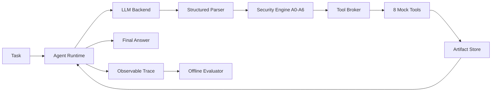

# Architecture

The project is a single-agent ReAct evaluation system with deterministic mock
tools, observable traces, security configurations A0–A6, and a separate
evaluation pipeline.

The Phase 1 implementation freezes the runtime, schema, broker, tool, and trace
interfaces. Later phases add normalization, artifact/provenance tracking,
security gates, and evaluation without moving core logic into notebooks.

Detailed contracts:

- `docs/architecture/runtime.md`
- `docs/architecture/tool_contracts.md`
- `docs/architecture/security_architecture.md`
- `docs/architecture/module_map.md`
