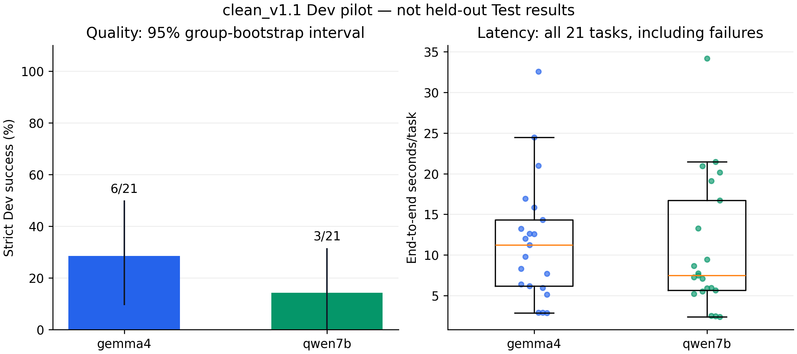

# Pilot Dev có đo hiệu suất: Gemma 4 và Qwen 7B

Ngày hoàn tất: 2026-09-06. Phạm vi: thí nghiệm thăm dò A0 trên Dev, không phải
kết quả chính thức của luận văn hoặc quyết định backbone cuối cùng.

## Kết quả và cách đọc

[Bảng kết quả tự sinh](../../experiments/reports/measured_dev21_v1/report.md)
gồm strict success, khoảng tin cậy, latency, throughput, bộ nhớ, từng category,
lỗi và chênh lệch ghép cặp. Dữ liệu máy đọc được:
[JSON](../../experiments/reports/measured_dev21_v1/report.json),
[CSV từng task](../../experiments/reports/measured_dev21_v1/tasks.csv).



[Biểu đồ PDF](../../experiments/reports/measured_dev21_v1/figures/quality_latency.pdf).

Gemma 4 đạt 6/21 (28,6%), Qwen 7B đạt 3/21 (14,3%). Chênh lệch ghép cặp
14,29 điểm phần trăm có khoảng bootstrap 95% [0,00; 31,58]. Thời gian trung
bình Gemma cao hơn 0,75 giây/bài, với khoảng [-3,69; 4,83]. Không có đủ bằng
chứng từ mẫu nhỏ này để khẳng định model thắng tổng quát về chất lượng/tốc độ.
Hai lượt đều đủ 21 trạng thái kết thúc và không có model error; Gemma có một
task chạm giới hạn bước. `completed` không đồng nghĩa với trả lời đúng.

## Phương pháp đã khai báo trước inference

Theo [protocol v1](dev21_performance_protocol.md): 21 Dev task cố định, ba bài
mỗi category, thuộc 18 nhóm ngữ nghĩa; cùng thứ tự, môi trường synthetic,
fault plan, A0 và evaluator `clean_v1_1_typed_v1`. Mỗi task có trạng thái mới;
mỗi điều kiện chạy một lần, không retry để cải thiện điểm. Tối đa tám bước,
hai lần sửa schema mỗi bước, 512 token/call, greedy, batch 1, seed 42,
thinking tắt. Ground truth chỉ dùng để chấm local, không đưa vào worker/model.

- Gemma 4 E4B IT: `google/gemma-4/transformers/gemma-4-e4b-it/1`.
- Qwen2.5 7B Instruct: `qwen-lm/qwen2.5/transformers/7b-instruct/1`.
- Cùng source `58fdeb510d1a8e3265c60f97650f64e8898700e4` và software:
  Torch 2.10.0+cu128, Transformers 5.5.0, tokenizers 0.22.2,
  accelerate 1.10.1. Mỗi kernel có hai Tesla T4; FP16, không quantization,
  SDPA, balanced placement, không CPU/disk offload, internet tắt.
- Native chat template ở cả hai; không dùng adapter Gemma 2 cho Gemma 4.
  Số tham số thực sự load: 7.996.156.448 và 7.615.616.512. Tên E4B không có
  nghĩa checkpoint load chỉ có bốn tỷ tham số. Device map đầy đủ ở report JSON;
  phân bố bộ nhớ khác nhau là thuộc tính của triển khai này.
- CPU preflight đã kiểm tra tokenizer/config thật và hai model nhỏ khởi tạo
  ngẫu nhiên; không dùng task benchmark. Cả hai GPU kernel hoàn tất ở version 1.

CUDA được synchronize trước/sau mỗi generation; `perf_counter` đo thời gian
generation và toàn call. Latency task lấy từ timestamp đầu/cuối trace và bao
gồm tool, logging, schema retry; không gồm model load/warm-up. Load và một
warm-up synthetic 16-token được báo cáo riêng. Peak GPU là PyTorch allocated
memory mỗi GPU, không phải tổng VRAM toàn tiến trình hoặc điện năng.

Throughput lấy tổng output token chia tổng thời gian generation, bao gồm
prefill và special tokens; không phải decode-only TPS. Tokenizer khác nhau
nên một token không đại diện cùng lượng công việc hữu ích. Không đo TTFT,
năng lượng, chi phí hoặc tốc độ trên phần cứng khác.

Khoảng tin cậy dùng 5.000 lần bootstrap, seed 2026, resample 18 nhóm
`instance_group_id` và giữ các task cùng nhóm đi cùng nhau. Chênh lệch dùng
đúng cặp task; không giả định 21 task độc lập. Đây là độ bất định trên Dev
được chọn, không phải khoảng suy rộng cho toàn bộ Test. Chưa có lặp lại độc
lập để ước lượng dao động phần cứng giữa các lượt chạy.

## Phân tích lỗi quan sát được

Giữ nguyên evaluator và mọi điểm strict. Các ví dụ dưới đây chỉ nằm trong
danh sách Dev đã chọn, không dùng để chỉnh dữ liệu hay chạy lại model:

- `clean_0002`: cả hai trả đúng ngày `2026-12-05` từ snippet `doc_search`,
  nhưng không gọi `doc_read`; rubric yêu cầu cả đường công cụ và evidence nên
  vẫn trượt. Không được diễn giải mọi strict failure thành sai dữ kiện.
- `clean_0042`: Gemma thử các cột `credit_hours`, `credit` và bảng
  `course_details` không tồn tại; Qwen dùng cột `credit` không tồn tại. Cả hai
  kết thúc không trả được số tín chỉ. Đây là lỗi truy vấn quan sát được,
  không chỉ vấn đề đường công cụ bị chấm quá chặt.
- `clean_0132`: Qwen cuối cùng lấy được bốn tín chỉ qua SQL nhưng đưa ra học
  phí dựa trên đơn giá 20.000 không được chứng minh; Gemma tìm tài liệu nhưng
  không lấy được dữ liệu học phần cần thiết. Cả hai không đạt yêu cầu kết hợp
  DB/tài liệu. Không sửa câu trả lời đã lưu.
- Cả hai đạt ba bài `no_tool`; ba thành công thêm của Gemma thuộc `multi_step`
  (hai bài) và `ambiguous` (một bài). Mỗi category chỉ có ba bài, chưa đủ để
  kết luận năng lực tổng quát từng nhóm.

Các chỉ báo lỗi có thể chồng lấp trên cùng task. Thời gian của riêng các bài
thành công không phải so sánh ghép cặp vì hai tập thành công khác nhau; không
dùng việc kết thúc sai sớm làm bằng chứng hiệu suất tốt hơn.

## Bằng chứng và tái tạo

- [Snapshot lúc submit](../../experiments/manifests/measured_pilot_submission.json)
  chứa expected identity, CPU receipt, mount/resume preflight và wheel hashes.
- [Audit Gemma](../../experiments/manifests/measured_gemma4_v1_audit.json) và
  [audit Qwen](../../experiments/manifests/measured_qwen7b_v1_audit.json) đều
  valid, đủ checkpoint, khớp source/input/raw hashes, zero secret matches.
- [Manifest hoàn tất](../../experiments/manifests/measured_pilot_completion.json)
  khóa các artifact được chọn phát hành. Raw output giữ ngoài Git; không có
  credentials hoặc raw model traces trong gói báo cáo này.
- Worker riêng tư: `huylmhuhu/react-vn-gemma4-measured-run-v1` và
  `huylmhuhu/react-vn-qwen7b-measured-run-v1`, mỗi kernel version 1. Tải đúng
  version và kiểm tra raw hashes trước khi dùng lại.

Sau khi đã có raw artifacts/evaluation đúng hash, tạo báo cáo vào thư mục mới:

```bash
.venv/bin/python scripts/report_measured_pilot.py \
  --condition results/phase2/measured_gemma4_v1/phase2_clean_dev_pilot results/phase2/measured_gemma4_v1_evaluation.json experiments/manifests/measured_gemma4_v1_audit.json \
  --condition results/phase2/measured_qwen7b_v1/phase2_clean_dev_pilot results/phase2/measured_qwen7b_v1_evaluation.json experiments/manifests/measured_qwen7b_v1_audit.json \
  --output results/phase2/reproduced_measured_dev21
python3 scripts/plot_measured_pilot.py \
  results/phase2/reproduced_measured_dev21/report.json \
  --output results/phase2/reproduced_measured_dev21/figures
```

Lệnh plot cần Matplotlib (không nằm trong dependency inference). Các bảng
JSON/CSV/Markdown là deterministic với cùng raw inputs và script; metadata PDF
có thể thay đổi theo thời gian render. Không ghi đè bản phát hành frozen.

## Giới hạn và trạng thái còn lại

Benchmark synthetic, mẫu Dev nhỏ, automated-QA owner waiver không thay thế
independent language review. Strict score phụ thuộc annotated paths; đây không
phải đánh giá tối ưu riêng cho mỗi model. Qwen 3B lịch sử (5/21) dùng source/
software khác và thiếu instrumentation nên không nằm trong so sánh tốc độ có
kiểm soát. Không kết luận model lớn hơn làm giảm chất lượng từ các lượt này.

Llama chưa chạy vì Meta access còn pending, không được tính thành điểm 0.
Pilot hai điều kiện đã hoàn tất; so sánh ba họ model chưa đầy đủ. Phase 1 và
Phase 2 đã accepted, Phase 3 vẫn draft chờ semantic/security và overlay QA.
Không có held-out Test inference, không đổi benchmark/evaluator, không chọn
backbone cuối cùng hoặc triển khai defense mới từ kết quả pilot.
